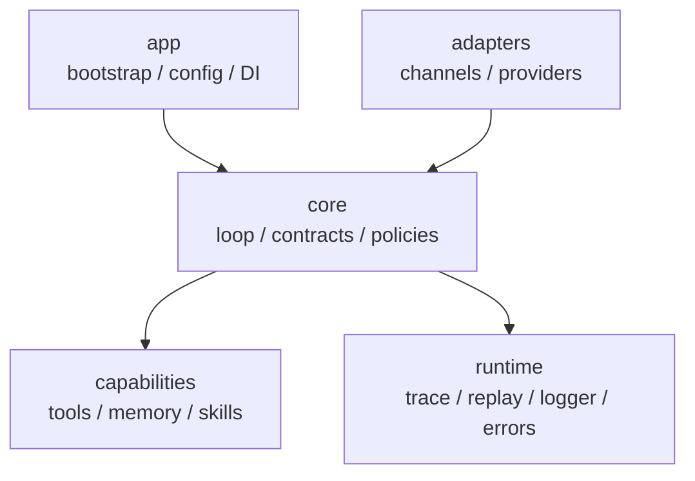

# VariPaw

可扩展的多渠道 AI Agent 框架，支持工具调用、记忆系统和技能文件驱动。  
An extensible multi-channel AI Agent framework with tool calling, memory, and skill-file driven behavior.

**Author / 作者**: Varisnow

## 项目简介 | Overview

**中文**  
VariPaw 是一个面向工程落地的 Agent 框架，目标是把“可对话、可调用工具、可长期演进”的能力做成清晰分层、可替换组件。它解决的问题是：当你把 Agent 接到不同渠道（CLI/Telegram/QQ）并接入工具、记忆、策略时，如何保持主链路稳定、结构可维护、行为可观测。

**English**  
VariPaw is an engineering-oriented agent framework that keeps conversation, tool use, and long-term evolution in a clean layered architecture. It addresses the practical challenge of connecting multiple channels (CLI/Telegram/QQ), tools, memory, and policies without turning the core loop into coupled, hard-to-maintain code.

## 架构图 | Architecture



## 核心特性 | Core Features

- **ReAct 循环 / ReAct Loop**: 支持思考-行动-观察链路，含工具调用与错误收敛  
- **多渠道适配 / Multi-Channel Adapters**: CLI、Telegram、QQ(OneBot v11)  
- **记忆系统 / Memory**: SQLite 短期记忆 + ChromaDB 语义检索  
- **技能文件系统 / Skill Files**: 兼容扁平与目录式技能文件，支持 OpenClaw/Nanobot 风格 metadata  
- **工具系统 / Tooling**: `web_search` / `web_reader` / `shell`  
- **策略系统 / Policies**: 步数限制、工具权限、超时、重试策略  
- **可观测性 / Observability**: trace、replay、结构化日志

## 快速开始 | Quick Start

### 1) 安装 | Install

```bash
python -m venv .venv
source .venv/bin/activate
pip install -U pip
pip install -e .
```

可选依赖 | Optional extras:

```bash
pip install -e ".[telegram]"
pip install -e ".[qq]"
```

### 2) 配置 `.env` | Configure `.env`

最小示例 | Minimal example:

```env
LLM_PROVIDER=deepseek
DEEPSEEK_BASE_URL=https://api.deepseek.com/v1
DEEPSEEK_API_KEY=your_key
DEEPSEEK_MODEL=deepseek-reasoner

VARIPAW_MAX_STEPS=10
VARIPAW_DATA_DIR=.varipaw/state
TZ_OFFSET=8
```

渠道配置示例 | Channel examples:

```env
TELEGRAM_BOT_TOKEN=your_telegram_bot_token

QQ_WS_URL=ws://localhost:3001
QQ_ACCESS_TOKEN=
```

### 3) 运行 | Run

CLI:

```bash
python -m varipaw.adapters.channels.cli_channel
```

Telegram:

```bash
python -m varipaw.adapters.channels.telegram_channel
```

QQ (OneBot v11):

```bash
python -m varipaw.adapters.channels.qq_channel
```

### 4) 测试 | Test

```bash
python -m unittest discover -s tests -p "test_*.py"
```

## 项目结构 | Project Structure

```text
varipaw/
├── varipaw/
│   ├── app/                # bootstrap, config, DI
│   ├── core/               # loop, contracts, policies
│   ├── capabilities/
│   │   ├── tools/          # web_search, web_reader, shell
│   │   ├── memory/         # sqlite/chroma/router
│   │   └── skills/         # skill definition/store/router
│   ├── adapters/
│   │   ├── channels/       # cli / telegram / qq
│   │   └── providers/      # openai-compatible provider
│   └── runtime/            # errors / trace / replay / logger
├── skills/                 # built-in skill files
├── tests/
└── docs/
```

## 技能文件 | Skill Files

VariPaw 支持两种技能文件结构：  
VariPaw supports two skill layouts:

- 扁平文件 / Flat: `skills/weather.md`
- 目录格式 / Directory: `skills/weather/SKILL.md`

示例（兼容 OpenClaw/Nanobot 风格 metadata）:

```markdown
---
name: weather
description: Get current weather and forecasts.
triggers: weather, forecast, temperature
always: false
metadata: {"nanobot":{"requires":{"bins":["curl"],"env":[]}}}
---
Use wttr.in first. If unavailable, fallback to other source.
```

说明 | Notes:
- `metadata.nanobot` 或 `metadata.openclaw` 都可识别  
- `requires.bins/env` 不满足时会自动过滤该 skill  
- `always: true` 的 skill 会始终注入 prompt

## 技术栈 | Tech Stack

Python 3.11+ / asyncio / OpenAI API / SQLite / ChromaDB / python-telegram-bot / websockets / unittest


## License

MIT
