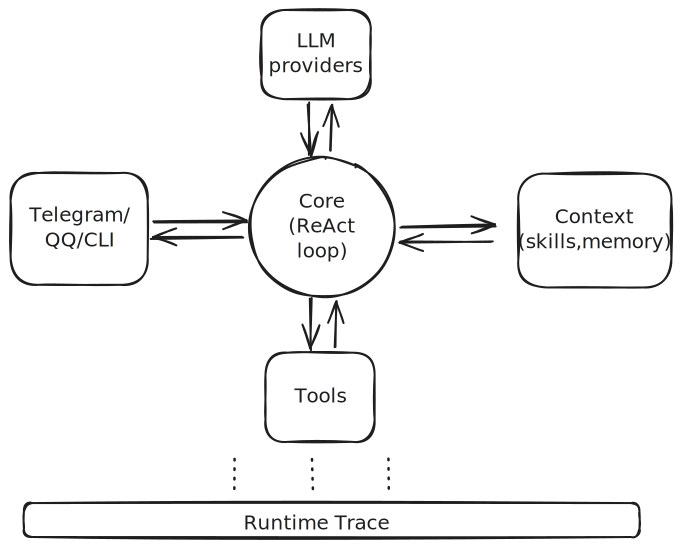

# VariPaw

分层清晰、可扩展的多渠道 AI Agent v0 Scaffold，内置工具调用、记忆系统与技能路由底座。  
A cleanly layered, extensible v0 scaffold for multi-channel AI Agents, featuring tool calling, memory, and skill routing behavior.

**Author / 作者**: Varisnow

## 项目简介 | Overview

**中文**  
VariPaw 并非一个需要从零学习和组装的庞大框架，而是一个面向工程落地的 AI Agent v0 Scaffold（工程脚手架）。  
它的核心目标是为你提供一个经过实战检验的底层骨架，把“多渠道交互、工具调用、长期记忆编排与技能路由”等能力固化为清晰的分层结构。它解决的核心问题是：当你准备把 Agent 接入各类真实渠道（CLI / Telegram / QQ），并配置复杂的工具与策略时，无需在庞杂的面条代码里挣扎——只需 Clone 本脚手架并在规范内“填空”或扩展，即可拥有一条主链路稳定、结构极易维护、且运行时完全可观测（Trace / Replay）的专属 Agent 引擎。

**English**  
Rather than a bloated framework you have to learn from scratch, VariPaw is an engineering-oriented v0 scaffold for AI Agents.  
It provides a battle-tested, out-of-the-box boilerplate that decouples conversation, tool use, memory management, and skill routing into a clean, layered architecture. It solves the practical challenge of agent deployment: when connecting to multiple channels (CLI / Telegram / QQ) with various tools and policies, you don't have to deal with coupled, hard-to-maintain code. Just clone this scaffold and build upon it to keep your core loop stable, extensible, and fully observable (Trace / Replay).


## 架构图 | Architecture

<p align="center">
  
</p>


## 核心特性 | Core Features

- **解耦的 ReAct 核心 / Decoupled ReAct Loop**: 
  基于接口（Protocol）抽象，将主循环逻辑与具体的通信渠道、存储引擎彻底分离。
- **长短期混合记忆 / Hybrid Memory**: 
  结合 SQLite（保存近期上下文）与 ChromaDB（长期语义检索），按需组装历史记录，控制 Token 消耗。
- **动态技能路由 / Dynamic Skills**: 
  通过独立的 `.md` 文件定义 AI 行为规范。支持根据用户输入动态匹配 Prompt，并在加载前自动进行宿主机环境（依赖/环境变量）自检。
- **受控的工具执行 / Controlled Tooling**: 
  提供 `web_search` / `web_reader` / `shell` 等基础工具。内置执行超时与输出截断机制，并为高危操作提供基于状态挂起的人工确认流（Human-in-the-loop）。
- **运行时可观测性 / Runtime Observability**: 
  记录单次请求的 Step 级执行链路（Trace），支持错误快照的本地回放（Replay），并统一输出结构化 JSON 日志以方便 Debug。
- **多渠道接入 / Multi-Channel Adapters**: 
  统一消息数据契约，目前内置 CLI、Telegram、QQ (OneBot v11) 三种接入端。

## 工程报告 | Engineering Report

想要深入了解 VariPaw 的系统分层逻辑、一次完整请求的主链路执行过程（Request Lifecycle）以及各子模块的代码级职责，请阅读详细的工程报告：
👉 [VariPaw 工程报告 (Engineering Report)](docs/engineering-report.md)

## 快速开始 | Quick Start

### 1) 安装 | Install

```bash
python -m venv .venv
source .venv/bin/activate
pip install -U pip
pip install -e .
```

可选依赖 | Optional extras:

```bash
pip install -e ".[telegram]"
pip install -e ".[qq]"
```

### 2) 配置 `.env` | Configure `.env`

最小示例 | Minimal example:

```env
LLM_PROVIDER=deepseek
DEEPSEEK_BASE_URL=https://api.deepseek.com/v1
DEEPSEEK_API_KEY=your_key
DEEPSEEK_MODEL=deepseek-reasoner

VARIPAW_MAX_STEPS=10
VARIPAW_DATA_DIR=.varipaw/state
TZ_OFFSET=8
```

渠道配置示例 | Channel examples:

```env
TELEGRAM_BOT_TOKEN=your_telegram_bot_token

QQ_WS_URL=ws://localhost:3001
QQ_ACCESS_TOKEN=
```

### 3) 运行 | Run

CLI:

```bash
python -m varipaw.adapters.channels.cli_channel
```

Telegram:

```bash
python -m varipaw.adapters.channels.telegram_channel
```

QQ (OneBot v11):

```bash
python -m varipaw.adapters.channels.qq_channel
```

### 4) 测试 | Test

```bash
python -m unittest discover -s tests -p "test_*.py"
```

## 项目结构 | Project Structure

```text
varipaw/
├── varipaw/
│   ├── app/                # bootstrap, config, DI
│   ├── core/               # loop, contracts, policies
│   ├── capabilities/
│   │   ├── tools/          # web_search, web_reader, shell
│   │   ├── memory/         # sqlite/chroma/router
│   │   └── skills/         # skill definition/store/router
│   ├── adapters/
│   │   ├── channels/       # cli / telegram / qq
│   │   └── providers/      # openai-compatible provider
│   └── runtime/            # errors / trace / replay / logger
├── skills/                 # built-in skill files
├── tests/
└── docs/
```

## 技能文件 | Skill Files

VariPaw 支持两种技能文件结构：  
VariPaw supports two skill layouts:

- 扁平文件 / Flat: `skills/weather.md`
- 目录格式 / Directory: `skills/weather/SKILL.md`

示例（兼容 OpenClaw/Nanobot 风格 metadata）:

```markdown
---
name: weather
description: Get current weather and forecasts.
triggers: weather, forecast, temperature
always: false
metadata: {"nanobot":{"requires":{"bins":["curl"],"env":[]}}}
---
Use wttr.in first. If unavailable, fallback to other source.
```

说明 | Notes:
- `metadata.nanobot` 或 `metadata.openclaw` 都可识别  
- `requires.bins/env` 不满足时会自动过滤该 skill  
- `always: true` 的 skill 会始终注入 prompt

## 技术栈 | Tech Stack

Python 3.11+ / asyncio / OpenAI API / SQLite / ChromaDB / python-telegram-bot / websockets / unittest


## License

MIT
