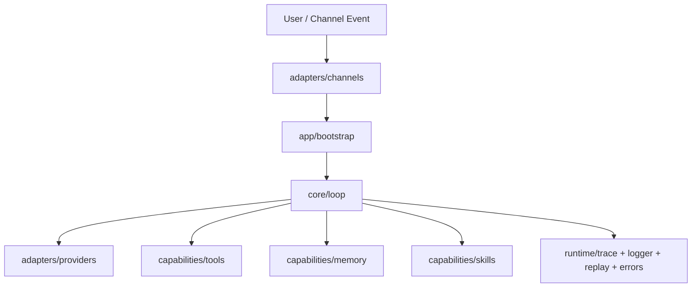

# VariPaw 工程报告

## 1. 项目目标与定位

VariPaw 是一个分层清晰、可扩展的多渠道 AI Agent 框架。  
核心目标是把以下能力组合到同一条稳定主链路中：

- 多渠道输入输出（CLI / Telegram / QQ）
- ReAct 推理与工具调用
- 结构化短期记忆 + 语义检索记忆
- 文件驱动技能系统
- 可配置策略系统
- 可观测运行时（trace / replay / logger / error envelope）

项目通过 `app -> core -> capabilities / adapters -> runtime` 的职责拆分，避免“把所有逻辑塞进一个入口文件”的耦合问题。

## 2. 总体架构

### 分层职责

- `app`：组装依赖、读取配置、生成运行容器
- `core`：定义契约、策略、Provider 协议与 ReAct 主循环
- `capabilities`：工具、记忆、技能等可复用能力
- `adapters`：对接外部渠道与模型 API
- `runtime`：日志、错误、追踪、回放

## 3. 主链路执行过程

一次请求从渠道进入到输出的主流程：

1. Channel 适配层把输入包装为 `UserMessage`
2. `AgentLoop.run()` 构造 history（system prompt + 当前时间 + skills + memory）
3. 调用 Provider 获取 `LLMResponse`
4. 如果是文本，直接结束并输出 `AgentResponse`
5. 如果是工具调用，写入 assistant tool_call 消息并调度工具
6. 工具结果回填 history，继续下一轮 ReAct
7. 结束时统一写 memory、replay、结构化日志

确认流（高风险工具）通过 `resume_confirmed_tool()` 继续执行，避免在渠道层复制业务逻辑。

## 4. 目录与模块说明（按代码块）

## 4.1 app 层

### `varipaw/app/bootstrap.py`

核心功能：

- 读取 `.env` 并初始化容器 `AppContainer`
- 构建并注入 `provider / tool_registry / memory / skills / policies / replay / logger`
- 统一外部配置入口（策略、路径、技能目录）

实现要点：

- `build_provider()`：按 `LLM_PROVIDER` 选择配置并创建 OpenAI-compatible provider
- `build_tool_registry()`：注册 `web_search/web_reader/shell`
- `build_memory()`：默认写入 `.varipaw/state/varipaw_memory.sqlite3`
- `build_skills()`：加载 `skills` 与 `.varipaw/skills`
- `build_policies()`：支持文件 + JSON + 环境变量覆盖
- `build_loop()`：集中注入所有依赖，保证 core 只关注执行

## 4.2 core 层

### `varipaw/core/contracts.py`

核心功能：

- 定义统一数据契约：`UserMessage / ToolCall / ToolResult / AgentStep / AgentResponse / ErrorEnvelope`
- 提供 `to_dict/from_dict` 与严格校验

实现要点：

- 所有对象在 `__post_init__` 做字段合法性检查
- `ContractParseError` 统一反序列化错误
- `ToolResult` 强制 `ok=True` 与 `data`、`ok=False` 与 `error` 的一致性

### `varipaw/core/validation.py`

核心功能：

- 集中提供字符串、数值、mapping、时间、错误码等校验工具
- 提供冻结/拷贝工具，防止可变结构泄露

实现要点：

- 统一 helper 在 contracts/policies/runtime 中复用
- 避免各模块重复实现校验逻辑

### `varipaw/core/provider.py`

核心功能：

- 定义 Provider 抽象协议与消息模型

实现要点：

- `BaseProvider.generate()` 是 loop 调用 provider 的唯一协议
- `LLMResponse` 强约束“文本响应”或“工具调用”二选一
- `ProviderError` 统一携带 `ErrorEnvelope`

### `varipaw/core/policies.py`

核心功能：

- 定义可调策略集：loop、tool 默认策略、tool 覆盖策略、重试策略

实现要点：

- `PolicySet.from_dict()` 支持外部配置输入
- tool 策略支持允许列表、超时、重试码控制

### `varipaw/core/loop.py`

核心功能：

- ReAct 主循环
- 工具分发、重试、超时、确认流
- 注入当前时间、skills、memory 到系统上下文

实现要点：

- `run()` 启动主链路；`resume_confirmed_tool()` 处理确认后继续
- `_dispatch_tool()` 集成 policy（allow/timeout/retry）
- `_build_initial_history()` 注入：
  - 当前时间（`TZ_OFFSET`）
  - skills 片段（匹配 + always）
  - memory 摘要
- `_make_step()` 统一产出 step 并写结构化日志
- `_finish()` 统一写 memory、replay

## 4.3 capabilities 层

### tools 子模块

#### `capabilities/tools/base.py`

核心功能：

- 定义 `ToolSpec` 和 `BaseTool`
- 统一异常映射为 `ToolResult`

实现要点：

- `invoke()` 包含参数校验、执行、异常边界
- 区分 `VALIDATION_ERROR / TOOL_TIMEOUT / TOOL_EXEC_ERROR / INTERNAL_ERROR`

#### `capabilities/tools/registry.py`

核心功能：

- 工具注册、查找、分发

实现要点：

- `dispatch()` 在缺失工具时返回标准 `TOOL_NOT_FOUND`
- 输出可用于 provider 的 tool schema 列表

#### `capabilities/tools/web_search.py`

核心功能：

- 封装网页搜索能力（duckduckgo）

实现要点：

- 参数校验（query/max_results）
- 统一结构化返回，兼容 loop 工具链

#### `capabilities/tools/web_reader.py`

核心功能：

- 拉取网页并抽取正文（readability + fallback）

实现要点：

- 对 URL、max_chars、超时进行约束
- 抽取失败时 fallback，尽量返回可用文本

#### `capabilities/tools/shell.py`

核心功能：

- 受控 shell 执行

实现要点：

- sandbox 路径约束
- 高风险命令通过确认机制返回 `REQUIRES_CONFIRMATION`
- 执行输出标准化为 `ToolResult`

### memory 子模块

#### `capabilities/memory/base.py`

核心功能：

- 定义记忆抽象：`MemoryTurn / SemanticHit / MemoryContext`
- 定义 `StructuredMemoryStore / SemanticMemoryStore / MemoryProvider` 协议

#### `capabilities/memory/sqlite_store.py`

核心功能：

- 存储会话短期记忆（结构化 turn）

实现要点：

- SQLite 持久化 + recent turns 查询

#### `capabilities/memory/chroma_store.py`

核心功能：

- 长期语义记忆检索

实现要点：

- 优先 Chroma，缺依赖时降级 fallback

#### `capabilities/memory/router.py`

核心功能：

- 统一编排结构化记忆 + 语义记忆

实现要点：

- `remember_turn()` 同时写入两类后端
- `build_context()` 返回 `MemoryContext`

### skills 子模块

#### `capabilities/skills/base.py`

核心功能：

- 定义 `SkillDefinition` 和 `SkillProvider` 协议

实现要点：

- 支持 `metadata` 与 `always` 字段
- `render()` 统一输出 skills prompt 片段

#### `capabilities/skills/store.py`

核心功能：

- 从文件系统加载技能

实现要点：

- 同时支持：
  - 扁平文件 `skills/*.md`
  - 目录结构 `skills/**/SKILL.md`
- 兼容 metadata JSON：
  - `nanobot` / `openclaw`
- 需求过滤：
  - `requires.bins`
  - `requires.env`
- 不满足要求的 skill 默认不加载

#### `capabilities/skills/router.py`

核心功能：

- 技能选择路由

实现要点：

- 保留原关键词评分规则
- `always=True` 技能先注入，再补齐匹配技能

## 4.4 adapters 层

### providers

#### `adapters/providers/openai_provider.py`

核心功能：

- OpenAI-compatible provider 适配器（兼容 openai/deepseek）

实现要点：

- 统一环境变量加载：
  - `OPENAI_*` / `DEEPSEEK_*`
- 把 SDK 异常映射到 `ProviderError(ErrorEnvelope)`
- 统一解析 tool_call 与普通文本响应

#### `adapters/providers/base.py`

核心功能：

- 对 `core.provider` 的兼容导出，避免适配层直接依赖细节变更

### channels

#### `adapters/channels/cli_channel.py`

核心功能：

- 终端交互入口

实现要点：

- 异步输入避免阻塞
- 与 loop 对接
- 支持工具确认交互（yes/no）

#### `adapters/channels/telegram_channel.py`

核心功能：

- Telegram Bot 通道

实现要点：

- 文本消息 -> `UserMessage`
- 确认流与 CLI 同步
- 避免重复回复（确认场景合并发送）

#### `adapters/channels/qq_channel.py`

核心功能：

- QQ OneBot v11 WebSocket 通道

实现要点：

- 解析 private/group 消息事件
- 自动重连
- API payload 深拷贝发送，防止原对象被修改
- 确认流复用 loop

## 4.5 runtime 层

### `runtime/errors.py`

核心功能：

- 标准错误工厂，统一 error_code 与 retriable 标记

### `runtime/logger.py`

核心功能：

- 结构化日志输出

实现要点：

- `LogContext` 规范 trace 相关字段
- `log_event()` 输出 JSON，禁止覆盖保留字段

### `runtime/trace.py`

核心功能：

- 记录单次请求的 step trace

实现要点：

- `TraceCollector` 负责过程收集
- `TraceRecord` 负责可序列化持久表示

### `runtime/replay.py`

核心功能：

- 运行结果回放

实现要点：

- 以 `trace_id` 存储 `AgentResponse`
- 提供快照与 trace record 转换

## 5. 测试与质量保障

测试目录 `tests/` 覆盖了：

- core contracts / loop / policies / validation
- capabilities tools / memory / skills
- adapters channels / providers
- runtime trace / replay / logger / errors

关键策略：

- 离线依赖注入（避免网络/三方 SDK 影响单测稳定性）
- 渠道层确认流单测
- skills 兼容性（扁平 + SKILL.md + metadata + requirements + always）

## 6. 配置体系

主要配置来源是 `.env`：

- Provider：`LLM_PROVIDER`, `OPENAI_*`, `DEEPSEEK_*`
- Policy：`VARIPAW_MAX_STEPS`, `VARIPAW_TOOL_TIMEOUT_SECONDS` 等
- Memory：`VARIPAW_DATA_DIR`, `VARIPAW_MEMORY_DB_PATH`
- Skills：`VARIPAW_SKILLS_DIR`, `VARIPAW_MAX_SKILLS`
- Channel：`TELEGRAM_BOT_TOKEN`, `QQ_WS_URL`, `QQ_ACCESS_TOKEN`

策略优先级：

1. 环境变量单项覆盖
2. `VARIPAW_POLICY_JSON`
3. `VARIPAW_POLICY_FILE`

## 7. 扩展指南

### 新增工具

1. 继承 `BaseTool`
2. 实现 `spec` 与 `run`
3. 在 `build_tool_registry()` 注册

### 新增渠道

1. 在 `adapters/channels` 新建适配器
2. 输入统一转 `UserMessage`
3. 输出统一使用 `AgentResponse.text`
4. 确认流复用 `resume_confirmed_tool()`

### 新增技能

1. 在 `skills/` 添加 `.md` 或 `SKILL.md`
2. 写 frontmatter（name/description/triggers/metadata/always）
3. 重启后自动加载

## 8. 当前工程状态结论

VariPaw 当前已经形成一条完整、可扩展、可观测的 Agent 主链路：  
从多渠道接入、到 ReAct 执行、到工具/记忆/技能编排、到 trace/replay/logging 闭环，工程骨架完整，后续重点应放在更强的工具生态、技能内容与渠道运维能力上。
